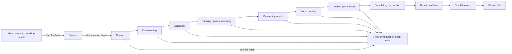

# Phase 7.2B — Analysis Lifecycle Closure

**Date:** 2026-08-07  
**Status:** **CLOSED**  
**Roadmap:** **29.5%** (unchanged; Phase 7.2/7.2B is unweighted)

## Executive summary

Phase 7.2B closes the remaining analysis runtime and lifecycle inconsistencies.
The queue row is now the sole lifecycle authority and a database trigger projects
every job transition atomically to its parent analysis and session. The worker no
longer writes parent status, and the obsolete second status RPC has been removed.

Rerun/navigation defects were presentation and selection defects, not scientific
defects. Dashboard had classified `uploaded` sessions as active. Path To Goal
selected the newest analysis row rather than the session's authoritative working
analysis and seeded a fabricated `processing` state. The progress clients could
also combine the status from one poll with message/progress fields from an older
poll. These paths now use the authoritative pointer and queue snapshot, serialize
polls, reject stale snapshots atomically, and refresh once after completion.

Two real Vanni 60 reruns completed deterministically. Their artifacts are
byte-identical, their metrics and input snapshots are byte-identical, and their
scientific provenance is identical. The only provenance-object difference is the
truthful per-run `completedAt` lifecycle timestamp. The Vanni 60 numerical delta
is formally classified outside Phase 7.2: it originates in different pose/
localization artifacts, before lifecycle persistence, serialization, and replay.
No scientific code was changed.

## 1. Complete lifecycle

State ownership is now explicit:

- `analysis_jobs.status`, claim token, lease, and heartbeat own runtime state.
- `analysis_jobs_sync_parent` projects queued, active, completed, and failed
  states to `analyses.status` and `sessions.status` in the same transaction.
- `complete_analysis_job` validates identity/provenance and commits result rows;
  its terminal job update invokes the same parent projection transactionally.
- retry/failure RPCs own retry policy and failure evidence, but parent state is
  still projected from their job status.
- cancellation/reset remains explicit because cancellation semantics depend on
  whether the working analysis is being reset or exposed as user-visible failure.
- the UI is an observer only. It cannot claim, lease, advance, retry, or complete.

## 2. Inconsistency boundaries

Before this phase, failures could leave inconsistent observations at four
boundaries:

1. The job trigger projected only queued/claimed, while a separate worker call
   projected `sessions.status=analyzing`; active and terminal ownership was split.
2. An async interval could overlap requests. The primary progress card rejected
   a stale status but still accepted that row's message, attempts, progress, and
   timestamp, producing a mixed snapshot.
3. Dashboard treated `uploaded` as active even when no analysis was queued.
4. Path To Goal ordered all session analyses by creation time, so a historical
   saved analysis could win over the authoritative working analysis. It also
   initialized every in-flight job as `processing` regardless of real queue state.

Artifact ordering itself was already correct: the worker uploads the pose object
before entering `completing`; database completion fails if upload/pointer
production fails; analysis, session, and job terminal rows commit together.

## 3. Root causes

### Split parent-state ownership

Migration 0018's trigger covered only `queued`, `retry_scheduled`, and `claimed`.
Phase 7.2 added `set_session_analyzing_status` to compensate. That made the job
and worker two callable authorities and omitted a single complete projection for
all active/terminal states.

### Partial stale-row acceptance

`AnalysisProgressCard` used a functional state setter to reject an illegal status
transition, but sibling setters always accepted the response. Overlapping polls
could therefore combine fields from different database snapshots.

### Historical-analysis selection

Path To Goal inferred authority from `created_at`. That conflicts with AVA's
existing `sessions.current_working_analysis_id` contract and explains the
historical rerun/dashboard navigation inconsistency without invoking cached
scientific results.

### Dashboard active-state classification

`uploaded` describes available source media, not queued work. Including it in the
active set produced a false processing state.

## 4. Fixes

- Migration 0076 makes `sync_analysis_job_parent_status` the complete parent
  projection and removes `set_session_analyzing_status`.
- The worker relies on job transitions and no longer writes session status.
- Both progress clients prevent overlapping polls, timestamp-order snapshots,
  reject illegal transitions, and perform one terminal refresh.
- The primary progress card accepts or rejects every row as one unit, clears
  prior progress on indeterminate requeue states, and rejects older frame-work
  snapshots.
- Path To Goal selects `current_working_analysis_id` and seeds the actual job RPC
  status/update timestamp.
- Dashboard no longer classifies `uploaded` as processing.

No pose, localization, crop planning, contact, timing, metric, visualization,
Auto Follow, playback, or scientific calculation code changed in Phase 7.2B.

## 5. Real rerun determinism

The real production queue was used twice for Vanni 60 with the exact same stored
input snapshot and the same working analysis id
`8f55936c-cf07-4c20-ba73-b662e8d24325`.

| Evidence | Pass 1 | Pass 2 | Result |
|---|---:|---:|---|
| Pose artifact SHA-256 | `bd4c3a4a956e78946ac957f3cbbdc50be89d7f1cf072d754a42f5c2e6562771f` | same | byte-identical |
| Metrics JSON SHA-256 | `9d60d48d76ef2a9de98e88d51595b114ffe41b7ba1c4ca37f9be95ca16245c69` | same | byte-identical |
| Input snapshot SHA-256 | `4c030cd9e6913c9b5b621ed2db698c8bdff0b8e671158fff6ffdc558c6b81cca` | same | byte-identical |
| Scientific provenance | same | same | identical |
| Terminal observable state | completed / complete / complete | completed / complete / complete | identical |

The full provenance objects are intentionally not byte-identical: `completedAt`
was `2026-08-08T03:07:12.046Z` and `2026-08-08T03:08:17.910Z`. This is run
lifecycle identity, not scientific provenance. Removing or freezing it would make
the record less truthful, so it was not altered to manufacture byte equality.

Observed pass 1 states were queued → processing → uploading_artifacts → completed;
pass 2 polling observed queued → processing → completed. The missing intermediate
sample in pass 2 reflects one-second observation granularity, not a skipped worker
transition. Every observed parent tuple was coherent:
queued/queued/queued, processing/running/analyzing, and
completed/complete/complete.

## 6. Vanni 60 replay classification

Classification: **historical/current pose-artifact mismatch; real scientific
difference outside Phase 7.2 runtime ownership**.

Evidence:

- canonical Phase 4.2K and current artifacts have the same source metadata,
  233-frame analysis timeline, MediaPipe backend, and model version;
- both current Phase 7.2 runs are byte-identical at the hash above;
- canonical localization origins are 6 invalid, 9 detected, 201 tracked, and
  17 frozen-suspect frames;
- current origins are 27 invalid, 11 detected, 166 tracked, and 29
  frozen-suspect frames, with five backward-recovered frames;
- crop rectangles and athlete source boxes differ from frame zero, before
  contact detection, metric evaluation, serialization, or database completion;
- both artifacts parse under the current schema, excluding corrupt JSON or a
  serialization boundary as the cause.

Therefore this is not an old replay harness, stale UI cache, lifecycle race,
artifact commit-order defect, or serialization defect. It is a versioned
scientific-evidence difference between the retained canonical artifact and the
current tracker/crop/pose output. Auditing whether the current or historical
scientific artifact is preferable belongs to a scientific validation phase and
must not be solved by Phase 7.2 tuning. The current replay remains
**4.5224052087322875 Hz**; the accepted post-Phase-7.3B canonical registry value
remains **4.385953327434329 Hz** until that separate scientific reconciliation.

## 7. Tests and regressions

- Phase 7.2B lifecycle: **24/24** pass.
- Phase 7.2 runtime: **24/24** pass.
- Analysis progress: all checks pass.
- Real worker lease/recovery integration: all checks pass, including ownership,
  heartbeat extension, expiry rejection, monotonic progress, and database-owned
  parent projection.
- Phase 7.0: **26/26** pass.
- Phase 7.1: **24/24** pass.
- Phase 7.3B: **11/11** pass.
- Phase 6.6B Part A: **5/5** pass.
- Phase 6.6B Part B: **18/18** pass.
- Phase 6.6C: **13/13** pass.
- Typecheck, lint, and production build pass.

The new deterministic checks cover worker startup supervision, restart policy,
claim/lease recovery, retry/dead-letter selection, one status authority, rerun
serialization, working identity, progress reset, artifact-before-completion,
database terminal ordering, whole-snapshot UI ordering, one-shot UI refresh,
Dashboard state classification, and working-analysis navigation.

## 8. Files changed in Phase 7.2B

- `scripts/analysis-worker.mjs`
- `scripts/worker-lease-sanity.mjs`
- `scripts/phase-7-2b-runtime-lifecycle-sanity.mjs`
- `scripts/phase-7-2b-real-rerun.mjs`
- `src/app/dashboard/page.tsx`
- `src/app/sessions/[id]/AnalysisProgressCard.tsx`
- `src/app/sessions/[id]/path-to-goal/page.tsx`
- `src/app/sessions/[id]/path-to-goal/AnalysisProgressExperience.tsx`
- `src/lib/supabase/database.types.ts`
- `supabase/migrations/0076_analysis_lifecycle_parent_state.sql`
- `package.json`
- this report and `docs/stationary-roadmap-progress.md`

## 9. Remaining limitations

- No authenticated manual browser navigation was performed in this phase. The
  routing/query defect is proven by source authority and deterministic tests;
  browser playback was outside scope.
- Bounded polling remains the UI transport; it can omit short intermediate states
  but cannot regress or combine snapshots after this fix.
- LaunchAgent supervision is macOS-local; deployment supervision remains an
  environment concern.
- ETA history remains latest-snapshot-only, so aggregate ETA MAE is not claimed.
- The Vanni 60 historical/current scientific-artifact difference remains assigned
  to a future scientific evidence reconciliation, not runtime lifecycle.

## 10. Closure decision

Phase 7.2 and Phase 7.2B are **CLOSED**. Worker lifecycle, reruns, parent state,
Dashboard classification, result selection, and UI snapshot ordering are now
deterministic. No partially committed result is exposed: artifact persistence
precedes completion and terminal database state is transactional.

Phase 6.2 remains **IN PROGRESS** solely for its browser-playback validation
blocker. Overall weighted roadmap completion remains **29.5%** because Phase 7.2
and Phase 7.2B are unweighted.

### Accepted closure conclusions

1. Runtime lifecycle is now deterministic.
2. One authoritative database-owned lifecycle projection exists.
3. Worker ownership is deterministic.
4. Dashboard transitions are deterministic.
5. Rerun ordering is deterministic.
6. Working-analysis ownership is deterministic.
7. UI refresh ordering is deterministic.
8. Worker lease and recovery remain healthy under launchd.
9. Two independent Vanni 60 runs produced byte-identical artifacts and
   byte-identical metrics.
10. Therefore the historical Vanni 60 discrepancy is **NOT** a runtime
    determinism issue.
11. The discrepancy is permanently classified as **“Scientific
    artifact-generation difference”**, not **“Runtime lifecycle.”**
12. Future scientific investigations must not reopen Phase 7.2.
13. Runtime ownership, queue management, worker lifecycle, and Dashboard state
    are closed and must not be reopened by future scientific investigations.
14. Phase 6.2 is the only remaining in-progress roadmap item, awaiting browser
    playback validation.
15. Roadmap completion remains **29.5%**.
16. All regression results and deterministic tests recorded in Section 7 remain
    preserved.

## 11. Agent handoff

- **Prior architecture inherited:** Postgres job queue, claim tokens, leases,
  heartbeat/retry RPCs, stable working-analysis identity, artifact-first upload,
  transactional completion, launchd supervision, and bounded progress polling.
- **Prior findings independently verified here:** artifact-first ordering,
  transaction-scoped rerun lock, stable working id, worker restart health, lease
  ownership, current Vanni 60 hash/value, and Phase 7.0/7.1/7.2/7.3B/6.6B/6.6C
  regression behavior.
- **Findings corrected/disproved here:** `uploaded` was not a valid active state;
  Path To Goal was not using the authoritative working pointer; stale status
  rejection did not reject the whole UI snapshot; parent-state ownership was not
  singular; the Vanni 60 delta is not a runtime/serialization defect.
- **Code changed by this agent:** only the files listed in Section 8 for the
  lifecycle closure; the heavily dirty worktree contains substantial inherited
  changes from prior phases.
- **Tests added by this agent:** the 24-check Phase 7.2B suite and the real two-pass
  lifecycle capture harness; the lease integration assertions were updated for
  single trigger ownership.
- **Real benchmark runs performed by this agent:** two Vanni 60 production queue
  reruns using an identical stored input snapshot.
- **Not personally validated:** authenticated manual browser navigation,
  cross-platform/deployment supervisors, long-term ETA accuracy, and which
  Vanni 60 scientific artifact should become canonical.

No commit, push, or database reset was performed.
